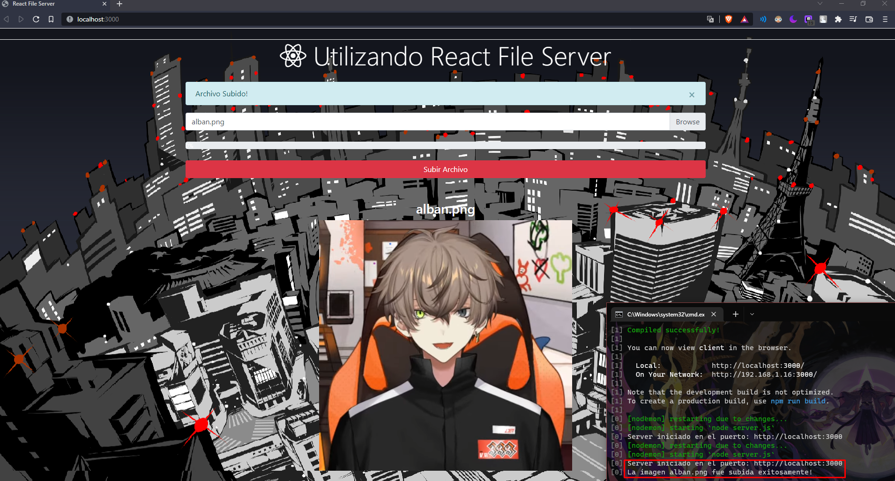
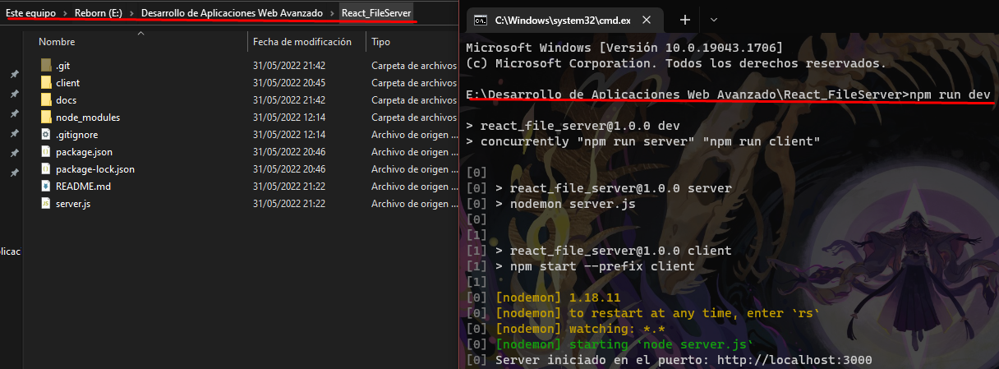

# ReactJS FileServer

> Este proyecto utiliza 2 proyectos de NodeJS, uno siendo el server (BackEnd) y el Otro la vista (FrontEnd)



## INSTALACIÓN

```bash
# Instalamos las dependencias del server
npm install
# Luego entramos a la carpeta de "client"
cd client
# Instalamos las dependencias
npm install
```

```bash
# Iniciamos en carpeta principal y asi es que escribiremos: 
npm run dev
```


>El server se encuentra en : http://localhost:3000
