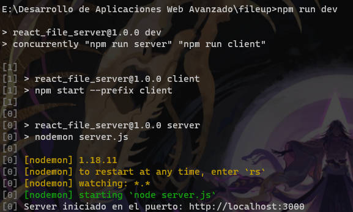

# ReactJS FileServer

> Este proyecto utiliza 2 proyectos de NodeJS, uno siendo el server (BackEnd) y el Otro la vista (FrontEnd)


## INSTALACIÓN

```bash
# Instalamos las dependencias del server
npm install
# Luego entramos a la carpeta de "client"
cd client
# Instalamos las dependencias
npm install

# El server se encuentra en : http://localhost:3000
npm run dev
```

